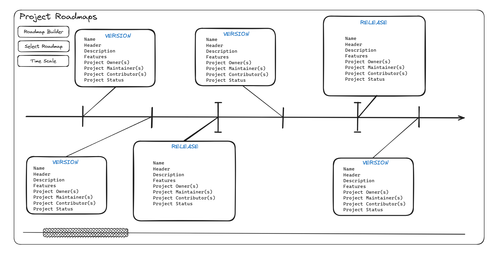

# project-roadmaps
uhstray.io project roadmaps web application and configuration

Testing GUI - https://pypi.org/project/Gooey/

Development GUI - https://flet.dev/docs/

# Project Architecture & Design

## Development Dependencies

1) Python 3.12.0 - `https://www.python.org/downloads/`
2) Flet GUI Library - `pip install flet`

## Application Pages
1) Project(s) Display
  - Header
    - Name
    - Description
  - Timeline
  - Releases
  - Versions
  - Features
  - Project Owner(s)
  - Project Maintainer(s)
  - Project Contributor(s)
  - Project Status
  
2) Roadmap Builder
  - Name
  - Description
  - Timeline
  - Releases
    - Status
  - Versions
    - Status
  - Features
    - Status
  - Project Owner(s)
  - Project Maintainer(s)
  - Project Contributor(s)
  - Project Status

3) Project Breakdown

## Elements

### Navigation
1) Projects & Roadmaps Button (Dynamic)
  - OR
1) Roadmap Builder Button (Dynamic)
   
2) Horizontal Slider (Timeline Navigation)
  - AND
2) Dynamic Scaling Slider 

3) Timescale Dropdown
  - Yearly
  - Quarterly
  - Monthly
  - Bi-Weekly
  - Weekly

4) Project Breakdown (Click into Release OR Version)

## Application Controls

https://flet.dev/docs/getting-started/flet-controls

## Publishing as a Web Application

https://flet.dev/docs/publish/web/dynamic-website/hosting/self-hosting/

## Using a CI/CD Pipeline to Deploy and Manage the Application

Github Actions

## Configuring Projects

## Configuring Roadmaps

## Configuring Features

## Using the Roadmap Application with Default User Access and Authentication

## Using the Roadmap API

